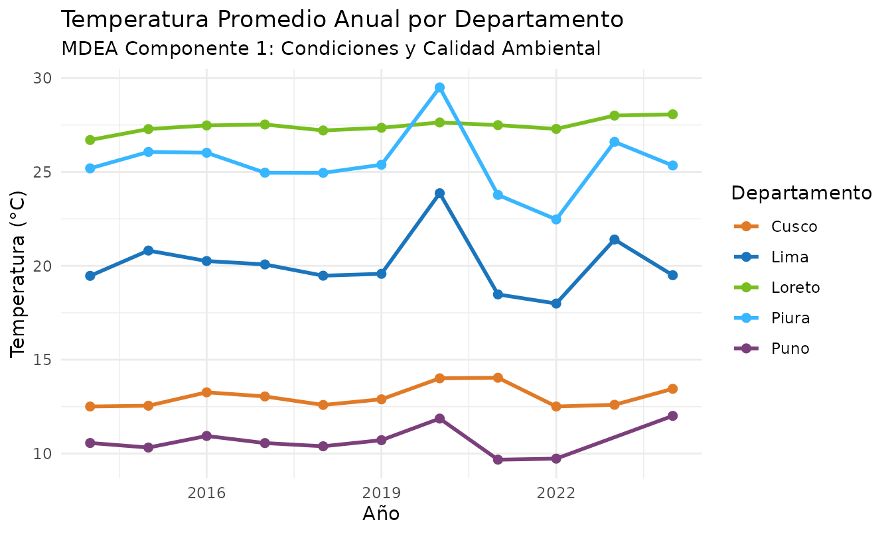

# Explorando los Componentes del Marco MDEA

## El Marco para el Desarrollo de las Estadísticas Ambientales (MDEA)

El **Marco para el Desarrollo de las Estadísticas Ambientales (MDEA /
FDES)** de las Naciones Unidas es la estructura metodológica
internacional adoptada por el Ministerio del Ambiente (MINAM) y el SINIA
para organizar las estadísticas ambientales del Perú.

El MDEA organiza toda la información ambiental en **6 componentes
principales**, cada uno enfocado en un aspecto del entorno natural y la
interacción humana:

| N° | Componente MDEA | Color Oficial | Ámbito y Temáticas Principales |
|:--:|:---|:--:|:---|
| **1** | **Condiciones y Calidad Ambiental** | `#38B6FF` | Atmósfera, clima, recursos hídricos, suelo, biodiversidad y calidad del aire/agua. |
| **2** | **Recursos Ambientales y su Uso** | `#E07A26` | Recursos forestales, minerales, energéticos, biológicos y uso de la tierra. |
| **3** | **Residuos** | `#7B3F7B` | Generación y disposición de residuos sólidos municipales, no municipales y aguas servidas. |
| **4** | **Eventos Naturales y Desastres** | `#2C3E50` | Desastres naturales (heladas, friajes, sismos, inundaciones) y peligros climáticos. |
| **5** | **Hábitat Humano y Salud Ambiental** | `#5E8D3B` | Asentamientos humanos, servicios básicos, salud ambiental y población expuesta. |
| **6** | **Protección y Gestión Ambiental** | `#D4AC0D` | Gasto ambiental, regulación, fiscalización, educación ambiental y áreas protegidas. |

------------------------------------------------------------------------

## 1. Búsqueda Directa por Palabras Clave

La forma más sencilla y amigable de encontrar estadísticas sin necesidad
de códigos complejos es mediante la función
[`sinia_buscar()`](https://paulesantos.github.io/siniaR/reference/sinia_buscar.md):

``` r

library(siniaR)
library(dplyr)
library(ggplot2)
```

``` r

# Buscar estadísticas sobre bosques y deforestación
bosques <- sinia_buscar("bosque")
bosques |> select(id, numeral, nombre)
#> # A tibble: 6 × 3
#>      id numeral nombre                                                          
#>   <int> <chr>   <chr>                                                           
#> 1    39 1.2.3.1 Superficie de bosque húmedo amazónico según departamento        
#> 2    40 1.2.3.2 Porcentaje de la superficie departamental con bosque húmedo ama…
#> 3    57 2.2.1.2 Pérdida de bosque húmedo amazónico según departamento           
#> 4    58 2.2.1.3 Variación anual de la tasa de pérdida de bosque húmedo amazónico
#> 5    60 2.2.1.5 Pérdida de bosque húmedo amazónico por categoría territorial    
#> 6    61 2.2.1.6 Cambio de uso de la tierra en bosque húmedo amazónico

# Buscar estadísticas sobre calidad del aire
aire <- sinia_buscar("aire")
aire |> select(id, numeral, nombre)
#> # A tibble: 3 × 3
#>      id numeral nombre                                                          
#>   <int> <chr>   <chr>                                                           
#> 1     1 1.1.1.1 Temperatura del aire promedio anual en estación de medición seg…
#> 2    41 1.3.1.1 Promedio anual de partículas inferiores a 2,5 micras (PM2,5) en…
#> 3    42 1.3.1.2 Promedio anual de partículas inferiores a 10 micras (PM10) en e…

# Buscar estadísticas sobre residuos sólidos
residuos <- sinia_buscar("residuos")
residuos |> select(id, numeral, nombre)
#> # A tibble: 18 × 3
#>       id numeral nombre                                                         
#>    <int> <chr>   <chr>                                                          
#>  1    65 3.1.1.1 Generación per cápita de residuos sólidos domiciliarios urbano…
#>  2    66 3.1.1.2 Generación total anual de residuos sólidos domiciliarios urban…
#>  3    67 3.1.1.3 Generación anual de residuos sólidos no domiciliarios según de…
#>  4    68 3.1.1.4 Generación per cápita de residuos sólidos municipales          
#>  5    69 3.1.1.5 Generación anual de residuos sólidos municipales según departa…
#>  6    70 3.1.1.6 Composición promedio de residuos sólidos domiciliarios según d…
#>  7   141 3.1.1.7 Generación per cápita de residuos sólidos no domiciliarios     
#>  8    71 3.1.2.1 Residuos sólidos municipales dispuestos en una infraestructura…
#>  9    72 3.1.2.2 Porcentaje de residuos sólidos municipales generados que se di…
#> 10   140 3.1.2.3 Áreas degradadas por residuos sólidos municipales para reconve…
#> 11   167 3.1.2.4 Áreas degradadas por residuos sólidos municipales para recuper…
#> 12   169 3.1.2.5 Superficie degradada por residuos sólidos municipales          
#> 13    73 3.2.1.1 Valorización de residuos sólidos municipales según departamento
#> 14    74 3.2.1.2 Porcentaje de residuos sólidos municipales valorizados con res…
#> 15    75 3.2.1.3 Número de municipalidades que implementan efectivamente la val…
#> 16    76 3.2.1.4 Número de municipalidades que implementan efectivamente la val…
#> 17    77 3.2.2.1 Número de productores de aparatos eléctricos y electrónicos (A…
#> 18    78 3.2.2.2 Cantidad anual de residuos de aparatos eléctricos y electrónic…
```

------------------------------------------------------------------------

## 2. Clasificación y Filtrado Amigable del Catálogo MDEA

Podemos enriquecer el catálogo completo del MDEA agregando una columna
legible con el nombre de cada componente, facilitando su exploración:

``` r

# Descargar el índice completo del MDEA
indicadores <- sinia_indicadores(marco = "mdea", solo_estadisticas = TRUE)

# Nombres descriptivos para cada uno de los 6 componentes
nombres_componentes <- c(
  "1" = "1. Condiciones y Calidad Ambiental",
  "2" = "2. Recursos Ambientales y su Uso",
  "3" = "3. Residuos",
  "4" = "4. Eventos Naturales y Desastres",
  "5" = "5. Hábitat Humano y Asuntos Socioambientales",
  "6" = "6. Protección y Gestión Ambiental"
)

# Agregar el componente de forma clara y legible
catalogo_mdea <- indicadores |>
  mutate(
    codigo_componente = substr(numeral, 1, 1),
    componente = nombres_componentes[codigo_componente]
  )

# Conteo de indicadores disponibles por componente
catalogo_mdea |>
  count(componente, name = "total_estadisticas")
#> # A tibble: 6 × 2
#>   componente                                   total_estadisticas
#>   <chr>                                                     <int>
#> 1 1. Condiciones y Calidad Ambiental                           60
#> 2 2. Recursos Ambientales y su Uso                             23
#> 3 3. Residuos                                                  18
#> 4 4. Eventos Naturales y Desastres                             20
#> 5 5. Hábitat Humano y Asuntos Socioambientales                 17
#> 6 6. Protección y Gestión Ambiental                            44
```

------------------------------------------------------------------------

## 3. Explorando los 6 Componentes con Ejemplos Prácticos

### Componente 1: Condiciones y Calidad Ambiental

Comprende variables meteorológicas y calidad del aire. Por ejemplo, la
temperatura promedio anual (ID = 1):

``` r

# Filtrar indicadores del Componente 1
c1_indicadores <- catalogo_mdea |>
  filter(codigo_componente == "1")

head(c1_indicadores |> select(id, numeral, nombre), 5)
#> # A tibble: 5 × 3
#>      id numeral nombre                                                          
#>   <int> <chr>   <chr>                                                           
#> 1     1 1.1.1.1 Temperatura del aire promedio anual en estación de medición seg…
#> 2     2 1.1.1.2 Temperatura máxima promedio anual en estación de medición según…
#> 3     3 1.1.1.3 Temperatura mínima promedio anual en estación de medición según…
#> 4     4 1.1.1.4 Precipitación total anual en estación de medición según departa…
#> 5     5 1.1.1.5 Humedad relativa promedio anual en estación de medición según d…

# Descargar datos de Temperatura del Aire (ID = 1) en formato largo
temp_peru <- sinia_datos(id = 1, pivot = "long")
head(temp_peru)
#> # A tibble: 6 × 3
#>   departamento  anio valor
#>   <chr>        <int> <dbl>
#> 1 Amazonas      2014  14.9
#> 2 Áncash        2014  12.5
#> 3 Apurímac      2014  14.2
#> 4 Arequipa      2014  16.1
#> 5 Ayacucho      2014  18.4
#> 6 Cajamarca     2014  15.0
```

### Componente 2: Recursos Ambientales y su Uso

Incluye recursos biológicos, forestales y energéticos:

``` r

# Filtrar indicadores del Componente 2
c2_indicadores <- catalogo_mdea |>
  filter(codigo_componente == "2")

head(c2_indicadores |> select(id, numeral, nombre), 5)
#> # A tibble: 5 × 3
#>      id numeral nombre                                                          
#>   <int> <chr>   <chr>                                                           
#> 1    48 2.1.1.1 Número de negocios sostenibles identificados en el catálogo de …
#> 2    49 2.1.1.2 Número de negocios sostenibles identificados en el Catálogo de …
#> 3    50 2.1.1.3 Ahorro anual en los consumos de agua, energía y papel reportado…
#> 4    51 2.1.1.4 Ahorro anual en el consumo de agua reportado por las entidades …
#> 5    52 2.1.1.5 Ahorro anual en el consumo de energía reportado por las entidad…
```

### Componente 3: Residuos

Monitorea la generación, reciclaje y disposición final de residuos:

``` r

# Filtrar indicadores del Componente 3
c3_indicadores <- catalogo_mdea |>
  filter(codigo_componente == "3")

head(c3_indicadores |> select(id, numeral, nombre), 5)
#> # A tibble: 5 × 3
#>      id numeral nombre                                                          
#>   <int> <chr>   <chr>                                                           
#> 1    65 3.1.1.1 Generación per cápita de residuos sólidos domiciliarios urbanos…
#> 2    66 3.1.1.2 Generación total anual de residuos sólidos domiciliarios urbano…
#> 3    67 3.1.1.3 Generación anual de residuos sólidos no domiciliarios según dep…
#> 4    68 3.1.1.4 Generación per cápita de residuos sólidos municipales           
#> 5    69 3.1.1.5 Generación anual de residuos sólidos municipales según departam…
```

### Componente 4: Eventos Naturales y Desastres

Registra ocurrencias de fenómenos naturales, heladas, friajes e
impactos:

``` r

# Filtrar indicadores del Componente 4
c4_indicadores <- catalogo_mdea |>
  filter(codigo_componente == "4")

head(c4_indicadores |> select(id, numeral, nombre), 5)
#> # A tibble: 5 × 3
#>      id numeral nombre                                                          
#>   <int> <chr>   <chr>                                                           
#> 1    79 4.1.1.1 Número de sismos ocurridos según departamento                   
#> 2    80 4.1.1.2 Rango de magnitudes de los sismos                               
#> 3    81 4.1.1.3 Número de alertas de peligros volcánicos por volcán             
#> 4    82 4.1.1.4 Número de boletines vulcanológicos emitidos por volcán          
#> 5    83 4.1.1.5 Número de monitoreo en las estaciones en las quebradas Huaycolo…
```

### Componente 5: Hábitat Humano y Asuntos Socioambientales

Enfocado en las condiciones de vida, acceso a servicios y salud
ambiental:

``` r

# Filtrar indicadores del Componente 5
c5_indicadores <- catalogo_mdea |>
  filter(codigo_componente == "5")

head(c5_indicadores |> select(id, numeral, nombre), 5)
#> # A tibble: 5 × 3
#>      id numeral nombre                                                          
#>   <int> <chr>   <chr>                                                           
#> 1    91 5.1.1.1 Número de comunidades amazónicas en el ámbito de intervención d…
#> 2    92 5.1.1.2 Mujeres que participaron en el programa de voluntariado ambient…
#> 3    93 5.1.2.1 Superficie de área verde por habitante según departamento       
#> 4    94 5.1.2.2 Superficie de área verde por habitante en Lima Metropolitana se…
#> 5    95 5.1.2.3 Superficie de área verde por habitante en la Provincia Constitu…
```

### Componente 6: Protección, Gestión y Participación Ambiental

Abarca gobernanza ambiental, áreas naturales protegidas e instrumentos
de gestión:

``` r

# Filtrar indicadores del Componente 6
c6_indicadores <- catalogo_mdea |>
  filter(codigo_componente == "6")

head(c6_indicadores |> select(id, numeral, nombre), 5)
#> # A tibble: 5 × 3
#>      id numeral nombre                                                          
#>   <int> <chr>   <chr>                                                           
#> 1   100 6.1.1.1 "Número de inversiones con presupuesto e inversiones ejecutadas…
#> 2   101 6.1.1.2 "Inversiones del Sector Ambiente según presupuesto y nivel de e…
#> 3   102 6.1.1.3 "Proyectos de inversión pública en el ámbito de intervención de…
#> 4   103 6.1.1.4 "Número de proyectos aprobados por el Senace por instrumentos d…
#> 5   104 6.1.1.5 "Número de proyectos aprobados por el Senace por sectores según…
```

------------------------------------------------------------------------

## 4. Visualización de Datos de un Componente MDEA

A continuación, visualizamos la evolución temporal de la temperatura del
aire en distintos departamentos (Componente 1):

``` r

departamentos_muestra <- c("Lima", "Loreto", "Cusco", "Piura", "Puno")

temp_filtrada <- temp_peru |>
  filter(departamento %in% departamentos_muestra, !is.na(valor))

ggplot(temp_filtrada, aes(x = anio, y = valor, color = departamento)) +
  geom_line(linewidth = 1) +
  geom_point(size = 2) +
  scale_color_manual(values = c(
    "Lima" = "#1B75BC",
    "Loreto" = "#78BE20",
    "Cusco" = "#E07A26",
    "Piura" = "#38B6FF",
    "Puno" = "#7B3F7B"
  )) +
  labs(
    title = "Temperatura Promedio Anual por Departamento",
    subtitle = "MDEA Componente 1: Condiciones y Calidad Ambiental",
    x = "Año",
    y = "Temperatura (°C)",
    color = "Departamento"
  ) +
  theme_minimal()
```



------------------------------------------------------------------------

## 5. Marco Temático Sectorial del SINIA

Adicionalmente al marco MDEA, el SINIA permite consultar la organización
sectorial propia del Ministerio del Ambiente mediante el argumento
`marco = "sinia"`:

``` r

# Catálogo sectorial propio del SINIA
sinia_tematico <- sinia_indicadores(marco = "sinia", solo_estadisticas = TRUE)
head(sinia_tematico |> select(id, numeral, nombre), 6)
#> # A tibble: 6 × 3
#>      id numeral nombre                                                
#>   <int> <chr>   <chr>                                                 
#> 1    10 1.1.1   Superficie de lagunas de origen glaciar por cordillera
#> 2    11 1.1.2   Número de lagunas de origen glaciar por cordillera    
#> 3    12 1.1.3   Número de lagunas de origen glaciar según departamento
#> 4    13 1.1.4   Superficie glaciar por cordillera                     
#> 5    14 1.1.5   Número de glaciares por cordillera                    
#> 6    15 1.1.6   Fluctuación del frente glaciar Huillca
```
