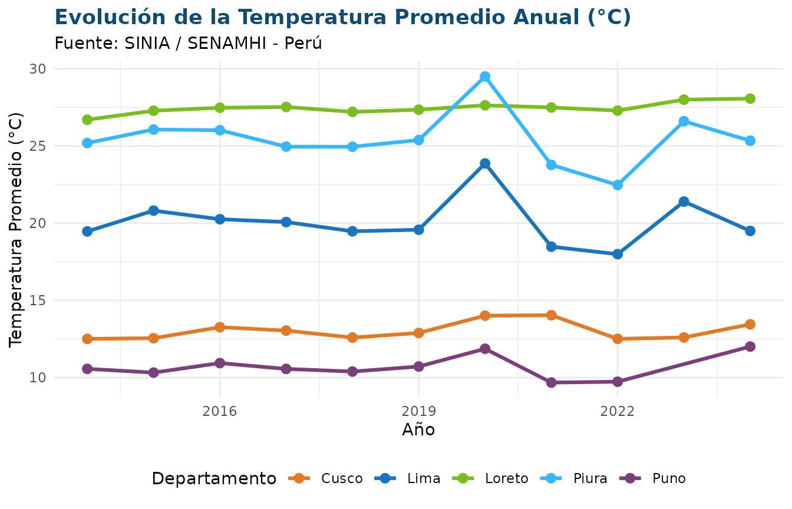

# Guía de Inicio Rápido a siniaR

## Introducción

El paquete **`siniaR`** proporciona una interfaz directa y programática
en R para consultar, estructurar y visualizar las estadísticas
ambientales oficiales del Perú desde el portal del **Sistema Nacional de
Información Ambiental (SINIA)**, administrado por el **Ministerio del
Ambiente (MINAM)**.

A través de `siniaR`, analistas, investigadores y tomadores de
decisiones pueden automatizar la extracción de series temporales,
consultar fichas técnicas metodológicas y generar visualizaciones
reproducibles.

``` r

library(siniaR)
library(dplyr)
library(ggplot2)
```

------------------------------------------------------------------------

## 1. Descubrimiento y Búsqueda de Indicadores

### Explorar el catálogo temático

Con
[`sinia_indicadores()`](https://paulesantos.github.io/siniaR/reference/sinia_indicadores.md)
podemos listar todas las estadísticas disponibles organizadas por su
árbol temático y código numeral:

``` r

# Listar todos los indicadores bajo el marco MDEA (ONU)
indicadores <- sinia_indicadores(marco = "mdea")
head(indicadores, 10)
#> # A tibble: 10 × 7
#>       id numeral nombre                     nivel clasificador_id padre_id marco
#>    <int> <chr>   <chr>                      <int>           <int>    <int> <chr>
#>  1     1 1.1.1.1 Temperatura del aire prom…     4              NA       55 mdea 
#>  2     2 1.1.1.2 Temperatura máxima promed…     4              NA       55 mdea 
#>  3     3 1.1.1.3 Temperatura mínima promed…     4              NA       55 mdea 
#>  4     4 1.1.1.4 Precipitación total anual…     4              NA       55 mdea 
#>  5     5 1.1.1.5 Humedad relativa promedio…     4              NA       55 mdea 
#>  6     6 1.1.1.6 Número de horas de sol an…     4              NA       55 mdea 
#>  7     7 1.1.1.7 Radiación ultravioleta pr…     4              NA       55 mdea 
#>  8     8 1.1.1.8 Ozono atmosférico mínimo,…     4              NA       55 mdea 
#>  9     9 1.1.1.9 Número de tipos de clima …     4              NA       55 mdea 
#> 10    10 1.1.2.1 Superficie de lagunas de …     4              NA       56 mdea
```

### Búsqueda por palabra clave

La función
[`sinia_buscar()`](https://paulesantos.github.io/siniaR/reference/sinia_buscar.md)
permite buscar estadísticas por términos clave sin distinguir
mayúsculas, minúsculas ni tildes:

``` r

# Buscar estadísticas relacionadas con calidad del aire o material particulado
aire <- sinia_buscar("pm10")
aire
#> # A tibble: 2 × 7
#>      id numeral nombre                      nivel clasificador_id padre_id marco
#>   <int> <chr>   <chr>                       <int>           <int>    <int> <chr>
#> 1    42 1.3.1.2 Promedio anual de partícul…     4              NA       62 mdea 
#> 2    44 1.3.1.4 Material particulado con d…     4              NA       62 mdea
```

------------------------------------------------------------------------

## 2. Consulta de la Ficha Técnica Oficial

Cada estadística en el SINIA cuenta con una **Ficha Técnica**
estandarizada que detalla la entidad generadora, la fórmula de cálculo,
el ámbito geográfico, la periodicidad de los datos y notas explicativas:

``` r

# Consultar la ficha técnica del indicador ID = 1 (Temperatura del aire)
ficha <- sinia_ficha(1)
ficha
```

También podemos acceder a cualquiera de sus campos directamente como una
lista:

``` r

ficha$fuente
#> [1] "Servicio Nacional de Meteorología e Hidrología (Senamhi)"
ficha$unidad_medida
#> [1] "Grado Celsius (°C)"
ficha$periodo_serie
#> [1] "2014-2024"
```

------------------------------------------------------------------------

## 3. Descarga y Transformación de Datos

La función
[`sinia_datos()`](https://paulesantos.github.io/siniaR/reference/sinia_datos.md)
procesa las matrices de datos del SINIA y permite obtenerlas
directamente en formato ancho (`"wide"`) o largo (*tidy*, `"long"`):

### Formato Largo (*Long / Tidy*)

Ideal para manipulaciones con `dplyr` y gráficos con `ggplot2`:

``` r

datos_temp <- sinia_datos(id = 1, pivot = "long")
head(datos_temp, 12)
#> # A tibble: 12 × 3
#>    departamento  anio valor
#>    <chr>        <int> <dbl>
#>  1 Amazonas      2014  14.9
#>  2 Áncash        2014  12.5
#>  3 Apurímac      2014  14.2
#>  4 Arequipa      2014  16.1
#>  5 Ayacucho      2014  18.4
#>  6 Cajamarca     2014  15.0
#>  7 Cusco         2014  12.5
#>  8 Huancavelica  2014  10.4
#>  9 Huánuco       2014  20.4
#> 10 Ica           2014  21.3
#> 11 Junín         2014  12.7
#> 12 La Libertad   2014  20.9
```

### Formato Ancho (*Wide*)

Ideal para reportes tabulares o resúmenes ejecutivos:

``` r

datos_wide <- sinia_datos(id = 1, pivot = "wide")
head(datos_wide, 6)
#> # A tibble: 6 × 12
#>   departamento `2014` `2015` `2016` `2017` `2018` `2019` `2020` `2021` `2022`
#>   <chr>         <dbl>  <dbl>  <dbl>  <dbl>  <dbl>  <dbl>  <dbl>  <dbl>  <dbl>
#> 1 Amazonas       14.9   15.1   15.6   15.2   14.8   15.0   15.3   15.0   15.0
#> 2 Áncash         12.5   12.8   13.1   12.3   12.0   12.4   13.4   11.2   11.1
#> 3 Apurímac       14.2   14.5   14.9   14.3   14.2   14.6   15.5   13.6   15.6
#> 4 Arequipa       16.1   17.1   17.3   16.6   16.6   17.0   17.4   16.2   16.0
#> 5 Ayacucho       18.4   18.3   18.8   18.1   17.1   17.0   18.2   17.4   17.7
#> 6 Cajamarca      15.0   15.4   15.6   15.0   14.9   15.0   15.5   14.9   14.8
#> # ℹ 2 more variables: `2023` <dbl>, `2024` <dbl>
```

------------------------------------------------------------------------

## 4. Visualización con ggplot2

Podemos combinar fácilmente los datos obtenidos con la estética del
SINIA:

``` r

# Descargar serie temporal de temperatura en formato tidy
df <- sinia_datos(1, pivot = "long")

# Filtrar departamentos representativos de costa, sierra y selva
deptos <- c("Lima", "Loreto", "Cusco", "Piura", "Puno")

df |>
  filter(departamento %in% deptos, !is.na(valor)) |>
  ggplot(aes(x = anio, y = valor, color = departamento)) +
  geom_line(linewidth = 1.1) +
  geom_point(size = 2.5) +
  scale_color_manual(values = c(
    "Lima" = "#1B75BC",
    "Loreto" = "#78BE20",
    "Cusco" = "#E07A26",
    "Piura" = "#38B6FF",
    "Puno" = "#7B3F7B"
  )) +
  labs(
    title = "Evolución de la Temperatura Promedio Anual (°C)",
    subtitle = "Fuente: SINIA / SENAMHI - Perú",
    x = "Año",
    y = "Temperatura Promedio (°C)",
    color = "Departamento"
  ) +
  theme_minimal(base_family = "sans") +
  theme(
    plot.title = element_text(face = "bold", color = "#0E4B75"),
    legend.position = "bottom"
  )
```



------------------------------------------------------------------------

## 5. Objeto Integrado (`sinia_estadistica`)

Si requieres tanto la ficha técnica completa como los datos tabulares en
una sola estructura:

``` r

est <- sinia_estadistica(1, pivot = "long")
est
#> # A tibble: 6 × 3
#>   departamento  anio valor
#>   <chr>        <int> <dbl>
#> 1 Amazonas      2014  14.9
#> 2 Áncash        2014  12.5
#> 3 Apurímac      2014  14.2
#> 4 Arequipa      2014  16.1
#> 5 Ayacucho      2014  18.4
#> 6 Cajamarca     2014  15.0
```
