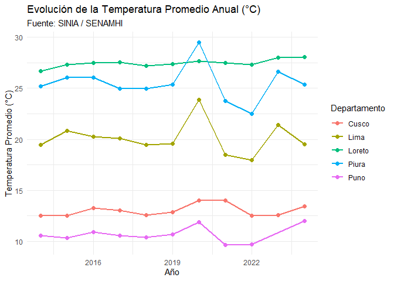

# siniaR 

**`siniaR`** es un paquete para R diseñado para facilitar el acceso
programático, exploración y análisis de las estadísticas ambientales
oficiales del Perú, provenientes del **Sistema Nacional de Información
Ambiental (SINIA / MINAM)** y del **Instituto Nacional de Estadística e
Informática (INEI)**.

## 📦 Instalación

Puedes instalar la versión de desarrollo de `siniaR` desde GitHub:

``` r

# install.packages("remotes")
remotes::install_github("PaulESantos/siniaR")
```

------------------------------------------------------------------------

## 🚀 Características Principales

1.  **Acceso directo al SINIA / MINAM en vivo**:
    - [`sinia_indicadores()`](https://paulesantos.github.io/siniaR/reference/sinia_indicadores.md):
      Catálogo de más de 180 estadísticas ambientales según el marco
      internacional MDEA (ONU) o el marco SINIA.
    - [`sinia_buscar()`](https://paulesantos.github.io/siniaR/reference/sinia_buscar.md):
      Búsqueda rápida de indicadores por palabras clave (ej.
      `"temperatura"`, `"pm10"`, `"glaciares"`, `"bosque"`).
    - [`sinia_ficha()`](https://paulesantos.github.io/siniaR/reference/sinia_ficha.md):
      Consulta interactiva de la **Ficha Técnica** oficial con
      metodologías, fuentes, fórmulas de cálculo y notas.
    - [`sinia_datos()`](https://paulesantos.github.io/siniaR/reference/sinia_datos.md):
      Descarga de series históricas en formato *tidy* (`wide` o `long`
      listo para `ggplot2`).
    - [`sinia_estadistica()`](https://paulesantos.github.io/siniaR/reference/sinia_estadistica.md):
      Objeto integrado con metadatos y datos tabulares.
2.  **15 Datasets Preempaquetados (INEI / SERNANP / SENAMHI)**:
    - Áreas de Conservación Privada y Regional (`acp_sernanp`,
      `acr_sernanp`).
    - Bosques y Cobertura Amazónica (`cap_pot_bosq_amaz`,
      `sup_dep_sup_bha`, `superficie_bha`).
    - Flora y Fauna (`flora_fauna_2013_2020`, `flora_fauna_ende`).
    - Clima y Meteorología (`temperatura`, `temperatura_maxima`,
      `precipitacion`, `humedad_rel`).
    - Calidad del Aire (`prom_mensual_pm_menor_10mcr`).
    - Hidrografía y Territorio (`rios_frontera`, `islas_islotes`,
      `xlsx_links`).

------------------------------------------------------------------------

## 💡 Ejemplos de Uso

``` r

library(siniaR)
library(dplyr)
library(ggplot2)
```

### 1. Explorar y buscar estadísticas en el SINIA

``` r

# Buscar estadísticas relacionadas a la calidad del aire
resultados <- sinia_buscar("PM10")
head(resultados)
#> # A tibble: 2 × 7
#>      id numeral nombre                      nivel clasificador_id padre_id marco
#>   <int> <chr>   <chr>                       <int>           <int>    <int> <chr>
#> 1    42 1.3.1.2 Promedio anual de partícul…     4              NA       62 mdea 
#> 2    44 1.3.1.4 Material particulado con d…     4              NA       62 mdea
```

### 2. Consultar la Ficha Técnica de un Indicador

``` r

# Consultar la ficha técnica de Temperatura Promedio Anual (ID = 1)
ficha <- sinia_ficha(1)
ficha
#> 
#> ── Ficha Tecnica: Temperatura del aire promedio anual en estación de medición se
#> • ID: 1 (Numero: 1)
#> • Fuente: Servicio Nacional de Meteorología e Hidrología (Senamhi)
#> • Unidad de Medida: Grado Celsius (°C)
#> • Periodo de Serie: 2014-2024
#> • Ambito Geografico: Nacional, Departamental, Provincial, Distrital, Estación
#>   de medición
#> • Clasificacion MDEA: 1.1.1
#> 
#> ── Descripcion ──
#> 
#> La temperatura del aire es uno de los elementos climáticos que está en relación
#> directa con el balance de energía, es decir, su valor o magnitud depende de la
#> fracción de Radiación Neta (Rn). Sin embargo, esta relación directa, entre
#> temperatura y Rn es afectado por otros factores como se ve a continuación: - El
#> movimiento de rotación de la tierra que da origen al ciclo diurno y el
#> movimiento de traslación que origina el ciclo anual. - La amplitud de estas
#> ondas (ciclo diurno de temperatura) son alterados por: la superficie sobre la
#> cual incide la radiación solar, masas de aire, nubosidad, transparencia
#> atmosférica, relieve topográfico, etc.
#> 
#> ── Formula de Calculo ──
#> 
#> Tapa = Suma de la temperatura del aire promedio mensual (Tapm) / Número de
#> meses con temperatura del aire promedio mensual (nm) del año (condición nm
#> >=7).  Tapm = Suma de la temperatura del aire promedio diaria (Tapd) / Número
#> de días con temperatura del aire promedio diario (nd) del mes (condición nd
#> >=16). Donde: Tapa: temperatura del aire promedio anual Tapm: temperatura del
#> aire promedio mensual Tapd: temperatura del aire promedio diario nd: número de
#> días del mes nm: número de meses del año
#> 
#> ── Metodologia ──
#> 
#> La temperatura del aire promedio anual es información procesada de los datos
#> provenientes de la lectura del termómetro y de los termómetros extremos
#> (máximos y mínimos) de las estaciones de medición ubicadas principalmente en
#> capital de departamento.
#> ℹ Nota: es el valor de la temperatura del aire promedio anual en la estación de medición, ubicada principalmente en capital de departamento. (…) No se cuentan con estadísticas.
```

### 3. Descargar datos en formato *Tidy* y visualizar

``` r

# Descargar datos en formato largo (long) para graficar
temp_long <- sinia_datos(1, pivot = "long")

# Filtrar algunos departamentos y visualizar la evolución temporal
deptos_interes <- c("Lima", "Loreto", "Cusco", "Piura", "Puno")

temp_long |>
  filter(departamento %in% deptos_interes, !is.na(valor)) |>
  ggplot(aes(x = anio, y = valor, color = departamento)) +
  geom_line(linewidth = 1) +
  geom_point(size = 2) +
  labs(
    title = "Evolución de la Temperatura Promedio Anual (°C)",
    subtitle = "Fuente: SINIA / SENAMHI",
    x = "Año",
    y = "Temperatura Promedio (°C)",
    color = "Departamento"
  ) +
  theme_minimal()
```



------------------------------------------------------------------------

## 📚 Datasets Preempaquetados

Puedes consultar la documentación de cualquier conjunto de datos
directamente con `?`:

``` r

?acp_sernanp
?temperatura
?prom_mensual_pm_menor_10mcr
```

------------------------------------------------------------------------

## 📄 Licencia

Este proyecto está bajo la Licencia MIT.
